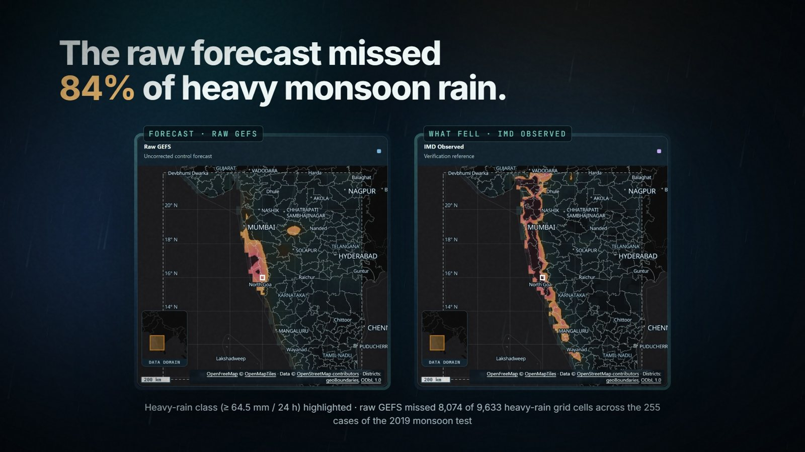
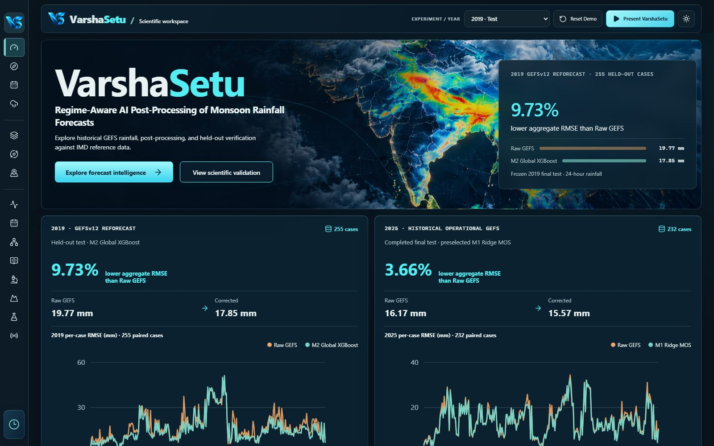
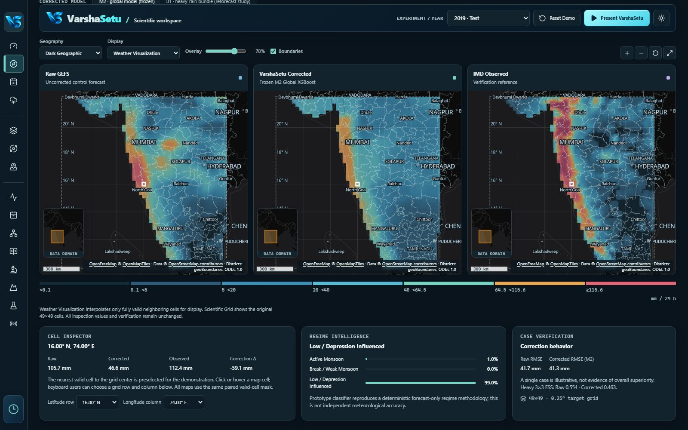
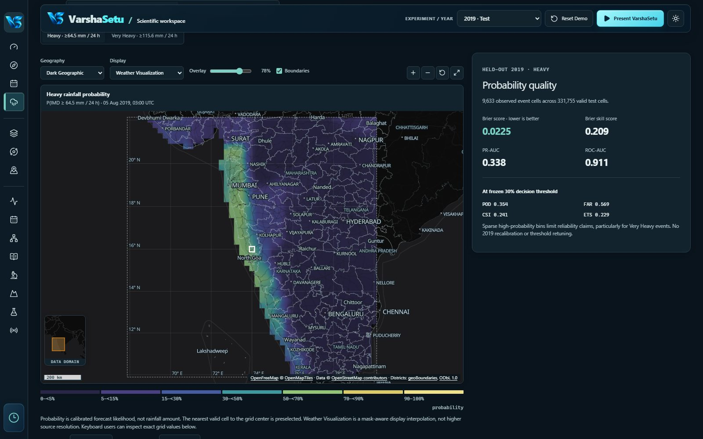
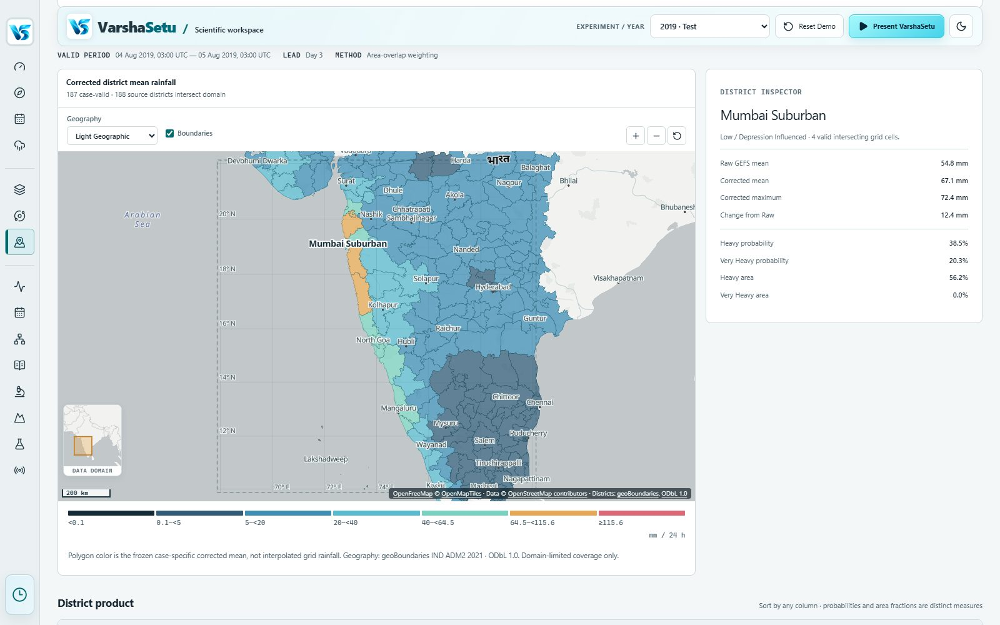
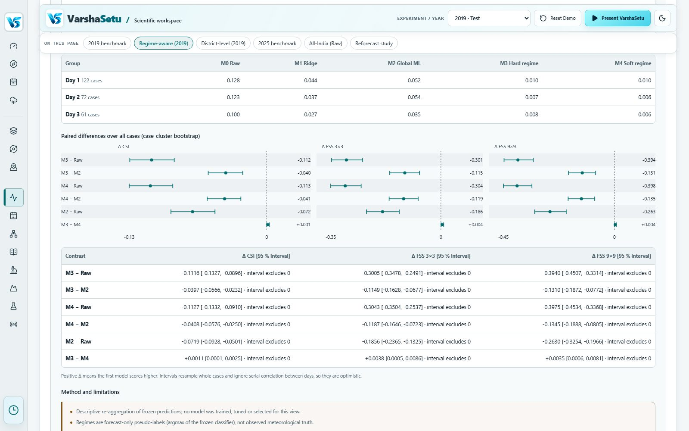
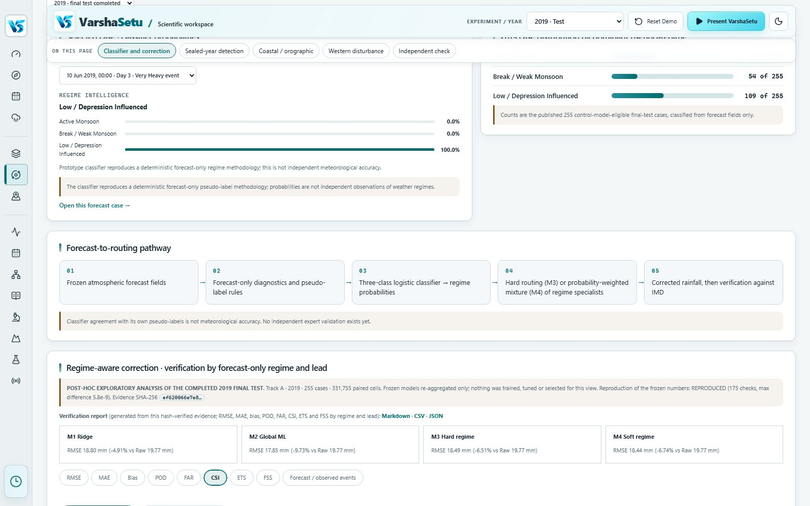
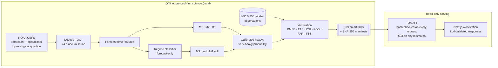

<div align="center">



# VarshaSetu

### Regime-aware AI post-processing of monsoon rainfall forecasts

*Bridging raw NWP forecasts and actionable rainfall intelligence*

Built for **Smart India Hackathon 2026 · SIH26080**<br/>
Ministry of Earth Sciences (MoES) · National Centre for Medium Range Weather Forecasting (NCMRWF)

[](https://github.com/iadityachourasia/VarshaSetu/actions/workflows/ci.yml)
[](backend/requirements.txt)
[](backend/requirements.txt)
[](frontend-v2/package.json)
[](frontend-v2/package.json)
[](frontend-v2/tsconfig.json)
[](backend/requirements.txt)
[](#-read-this-first)

**[Live app](https://varshasetu.vercel.app)** · **[Live API](https://varshasetu.onrender.com/docs)** · [Results](#-results) · [Architecture](#-architecture) · [Quick start](#-quick-start) · [Docs](docs/00_INDEX.md)

</div>

---

## 📌 Read this first

> [!IMPORTANT]
> VarshaSetu is a **historical scientific research prototype**, not an operational forecast or warning service. It corrects archived NOAA GEFS rainfall forecasts and verifies them against archived IMD gridded observations. Every number on the site and in this README is a frozen, hash-verified result from a completed historical test, and each one says which test it comes from. You can check any of them yourself against the [live API](#-verify-it-yourself).

---

## Contents

- [The problem](#-the-problem)
- [What VarshaSetu does](#-what-varshasetu-does)
- [Screenshots](#-screenshots)
- [Results](#-results)
- [SIH26080 requirement coverage](#-sih26080-requirement-coverage)
- [Product tour](#-product-tour)
- [Architecture](#-architecture)
- [Tech stack](#-tech-stack)
- [Quick start](#-quick-start)
- [Testing and quality](#-testing-and-quality)
- [Deployment](#-deployment)
- [Verify it yourself](#-verify-it-yourself)
- [Scientific integrity rules](#-scientific-integrity-rules)
- [Repository layout](#-repository-layout)
- [Documentation](#-documentation)
- [Limitations and roadmap](#-limitations-and-roadmap)
- [Data sources and acknowledgements](#-data-sources-and-acknowledgements)

---

## 🌧 The problem

Numerical weather prediction (NWP) models such as NOAA's GEFS produce rainfall forecasts with systematic, place-dependent and weather-dependent errors. Over India's monsoon they smear and under-forecast the heavy rain that matters most. On the 2019 test cases, raw GEFS caught only **1,559 of 9,633** heavy-rain grid cells (≥ 64.5 mm / 24 h) along the west coast: **16%**.

SIH26080 asks for an AI layer that recognises the weather regime a forecast is in (active monsoon, break, low/depression, coastal/orographic, western disturbance), corrects the forecast accordingly, and delivers bias-corrected rainfall, heavy and very-heavy rain probabilities, and grid and district products, all verified with RMSE, ETS, CSI, POD, FAR and FSS.

## 🧭 What VarshaSetu does

```text
Raw NWP forecast ─► forecast-time features ─► regime probabilities ─► regime-aware correction
      ─► corrected rainfall grid ─► heavy / very-heavy probabilities ─► district product ─► verification
```

- **Corrects rainfall** with a ladder of frozen models: raw (M0), linear MOS (M1), global XGBoost (M2), hard regime routing (M3) and a soft regime mixture of experts (M4), plus a heavy-rain bundle (B1) from the reforecast study.
- **Detects regimes from the forecast alone.** No observation enters the forecast-time classifier.
- **Estimates heavy and very-heavy rain** as calibrated probabilities, and separately as a heavy-rain classifier score with a frozen yes/no threshold.
- **Delivers grid and district products** for 188 districts on a 0.25° grid over 10–22° N, 68–80° E.
- **Verifies everything** with the full metric set, by regime, by lead day and by district, and exports the reports as Markdown, CSV and JSON.
- **Serves only frozen, hash-checked evidence.** Every API response is checked against its SHA-256 chain, and any mismatch returns an honest error (HTTP 503).

---

## 🖼 Screenshots

<table>
<tr>
<td width="50%"><br/><sub><b>Overview</b>: both historical benchmarks, never pooled</sub></td>
<td width="50%"><br/><sub><b>Forecast Explorer</b>: Raw → corrected → IMD on one shared pointer</sub></td>
</tr>
<tr>
<td><br/><sub><b>Extreme Rain</b>: calibrated probability with Brier, PR-AUC and threshold skill</sub></td>
<td><br/><sub><b>District Intelligence</b>: area-weighted district product, map and table linked</sub></td>
</tr>
<tr>
<td><br/><sub><b>Verification Lab</b>: regime- and lead-wise skill with paired intervals</sub></td>
<td><br/><sub><b>Regime Intelligence</b>: forecast-only regime probabilities and routing</sub></td>
</tr>
</table>

---

## 📊 Results

Two forecast lineages are evaluated as **separate, non-pooled experiments**, and each result names its own population. There is no "combined" skill number anywhere in the project, and a static test enforces that ([`science-copy-guard.test.ts`](frontend-v2/src/lib/science-copy-guard.test.ts)).

| | Track A: GEFSv12 reforecast | Track B: operational-era GEFS |
|---|---|---|
| **Years** | 2017 train · 2018 validate · **2019 test** | 2023 cross-fit · 2024 validate · **2025 final test** |
| **Forecast** | NOAA GEFSv12 reforecast archive | NOAA operational GEFS archive |
| **Reference** | IMD 0.25° gridded rainfall | IMD 0.25° gridded rainfall |
| **Test population** | 255 cases · 331,755 paired cells | 232 cases · 301,832 paired cells |

### Headline figures

| Result | Raw | Corrected | Change | Population |
|---|---|---|---|---|
| Rainfall RMSE, global XGBoost (M2) | 19.77 mm | **17.85 mm** | **−9.73%** | 2019 held-out test |
| Rainfall RMSE, preselected Ridge MOS (M1) | 16.17 mm | **15.57 mm** | **−3.66%** | 2025 final test |
| Heavy-rain cells caught, B1 classifier | 16% | **66%** | 1,559 → 6,348 of 9,633 | 2019 cases, post-hoc |
| Rainfall RMSE, B1 regression | 14.32 mm | **12.75 mm** | −1.57 mm [−1.82, −1.33] | Sealed reforecast years 2014–2016 |
| Heavy-rain CSI, B1 classifiers | 0.085 | **0.253** | +0.168 [0.142, 0.193] | Sealed 2014–2016 |
| Very-heavy CSI, B1 classifiers | 0.050 | **0.153** | +0.103 [0.071, 0.136] | Sealed 2014–2016 |

> [!NOTE]
> **The costs are stated next to the gains.** The B1 classifiers flag roughly twice as many heavy-rain cells as occur (frequency bias about 1.9), so false alarms rise with hits. Their scores are classifier scores, not calibrated probabilities. On the sealed years the B1 regression over-forecasts by about 1.8 mm, above the frozen 1.5 mm guardrail, so its pre-registered decision tier is **none** even though RMSE and both CSIs improve with intervals that exclude zero. In 2025, raw GEFS kept better heavy and very-heavy spatial skill (FSS) than the RMSE-selected M1.

<details>
<summary><b>Regime detection on sealed years (2014–2016)</b></summary>

Five forecast-only detectors, each a standardised logistic model compared against a climatology baseline. The verdict rule was frozen before the sealed years were opened.

| Regime state | Sealed cases (+ / −) | AUC [95%] | Gain over climatology [95%] | Verdict |
|---|---|---|---|---|
| Active monsoon | 418 (68 / 350) | 0.932 [0.899, 0.960] | +0.257 [0.184, 0.332] | validated and useful |
| Break monsoon | 418 (59 / 359) | 0.870 [0.806, 0.928] | +0.446 [0.346, 0.543] | validated and useful |
| Low / depression | 778 (117 / 661) | 0.802 [0.749, 0.851] | +0.401 [0.332, 0.466] | validated and useful |
| Western disturbance | 778 (113 / 665) | 0.721 [0.653, 0.783] | +0.170 [0.085, 0.249] | validated and useful |
| Coastal / orographic rain day | 778 (111 / 667) | 0.976 [0.965, 0.985] | +0.195 [0.151, 0.241] | validated and useful |

Labels are objective rules (IMD spells, ERA5 reanalysis vorticity and troughs), not expert analyses. ERA5 labels past days only and is never a forecast input. The western-disturbance result largely verifies the forecast height field. See [docs/142](docs/142_REFORECAST_STUDY_RESULTS.md).

</details>

<details>
<summary><b>Model ladder and the regime-aware finding</b></summary>

| Model | Role | Description |
|---|---|---|
| **M0** | Reference | Raw NWP forecast, uncorrected |
| **M1** | Preselected primary (2025) | Ridge MOS, a transparent statistical baseline |
| **M2** | Global ML | Global (non-regime) XGBoost |
| **M3** | Regime-aware | Hard regime routing to specialist models |
| **M4** | Regime-aware | Soft probabilistic regime mixture of experts |
| **B1** | Heavy-rain bundle | Event-weighted XGBoost with static geography + exceedance classifiers (reforecast study) |

Regime awareness improves on raw in both tracks. It does **not** beat the global model M2 on overall RMSE. On heavy-rain CSI and FSS, M3 and M4 beat raw and M2 only in the low/depression pseudo-regime, and the break/weak specialists collapse to "no extreme rain". In 2025, M4 beats M3 in every paired pseudo-regime population, but neither beats M2 overall. See [docs/106](docs/106_REGIME_CATEGORICAL_AND_FSS_DIAGNOSTICS.md) and [docs/108](docs/108_EVIDENCE_PACKAGING_AND_TRACK_A_REGIME_DIAGNOSTICS.md).

</details>

<details>
<summary><b>District verification, geography and other findings</b></summary>

- **District verification** runs under a protocol frozen before any result (E1 primary event, ≥ 30 observed events, ≥ 5 valid cells, latitude bands). In Track B, district event CSI improves for M3 and M4 while district-mean error worsens. In Track A, district-mean error improves while district heavy-rain CSI stays below raw. See [docs/113](docs/113_DISTRICT_VERIFICATION_RESULTS.md) and [docs/135](docs/135_DISTRICT_VERIFICATION_TRACK_A.md).
- **Geography:** the Western Ghats coast concentrates heavy rain, and every frozen model under-forecasts it ([docs/117](docs/117_ZONE_VERIFICATION_STAGE1.md)). A geography-aware correction passed its single independent test on 2022 (zone heavy CSI +0.042, modest and partly over-forecasting; [docs/133](docs/133_GEOGRAPHY_AWARE_FOLLOWUP_2022_TEST_RESULT.md)).
- **Independent regime check:** the pseudo-class named "Active" does not match observed active spells ([docs/136](docs/136_INDEPENDENT_REGIME_VALIDATION_RESULTS.md)).
- **All-India:** raw GEFS only, verified by region across the whole IMD grid; no model is applied outside the study box ([docs/140](docs/140_ALL_INDIA_RAW_VERIFICATION.md)).

</details>

---

## ✅ SIH26080 requirement coverage

Status comes from a machine-readable coverage manifest ([`ps_coverage.json`](backend/app/evidence_data/phase6/ps_coverage.json)). Every "implemented" row links to evidence a validator checks.

**27 of 30 requirements implemented · 3 partial · 0 missing**

| Area | Requirements | Status |
|---|---|---|
| Input and regimes | Raw NWP input · regime classifier · active · break · low/depression · coastal/orographic · western disturbance | ✅ Implemented |
| Correction | ML post-processing · regime-aware correction · bias-corrected rainfall · improvement over raw | ✅ Implemented |
| Extremes | Heavy-rain probability · very-heavy-rain probability | ✅ Implemented |
| Products | Grid product · district product · district map · district table · synoptic overlays | ✅ Implemented |
| Verification | RMSE · ETS · CSI · POD · FAR · FSS · verification report · regime-wise · district-level | ✅ Implemented |
| Partial | Independent (expert/bulletin) regime validation · live new-cycle post-processing · all-India domain | 🟡 Partial: each states what exists and why the rest is out of reach ([docs/141](docs/141_COMPLETION_CLOSING_AUDIT.md)) |

---

## 🗺 Product tour

| Page | What it shows |
|---|---|
| **Overview** | The two historical benchmarks side by side with per-case RMSE charts, scientific boundary notes and entry points |
| **Forecast Explorer** | Raw GEFS, corrected and IMD observed maps on one shared pointer; M2 ↔ B1 switch; cell inspector; regime context; synoptic chart (wind, height, pressure) |
| **Event Casebook** | All 2019 cases, filterable by observed event, lead and outcome, sortable, linking into each forecast |
| **Extreme Rain** | Calibrated heavy and very-heavy probabilities with reliability, Brier, PR-AUC and threshold skill; B1 classifier score and yes/no view |
| **Ensemble & Uncertainty** | Five-member subset fields and member distribution for a selected cell |
| **Regime Intelligence** | Per-case classifier probabilities, case distribution, routing pathway, regime- and lead-wise verification, sealed-year detection, coastal/orographic and western-disturbance indicators, independent check |
| **District Intelligence** | Area-weighted district rainfall, probabilities and flagged area; model comparison, error map and district history |
| **Verification Lab** | Benchmarks, model ladder, FSS and reliability, regime-aware tab, district-level verification, all-India raw, reforecast study; downloadable reports |
| **Observations · Data Quality · Methodology · Scientific Audit** | IMD context, source-to-eligibility flow, pipeline and lineage, holdout governance and known limitations |
| **Geographic Zones · Geography-Aware** | Coastal/orographic zone verification and the pre-registered geography-aware experiment |
| **Experimental Live Cycle** | The frozen models applied to a stored GEFS cycle through the live code path (a pipeline proof, not a forecast) |
| **Present VarshaSetu** | A guided story mode for demos, with every figure derived from evidence |

**Interface:**
- Light and dark themes with phone layouts.
- Linked hovers between legends, maps and tables; scroll-spy page contents.
- One-click copy of any evidence hash.
- Reduced-motion support throughout, and automated WCAG A/AA checks in the test suite.

---

## 🏗 Architecture



**Design principles**

- **Protocol first.** Decision rules, thresholds and populations are frozen and hashed *before* any result is computed, and outputs are write-once.
- **No future information.** Predictors are only what exists at forecast time. Observations are used for verification, never as inputs.
- **Read-only serving.** The API never trains, decodes GRIB or computes a scientific result at request time.
- **Honest failure.** A broken hash chain is a visible 503. A network outage falls back to a checked-in, clearly labelled static bundle, and an integrity failure is never masked.
- **Never pooled.** The two forecast lineages, and each year's role (train, validate, test), are kept apart and labelled.

---

## 🧰 Tech stack

| Layer | Technology |
|---|---|
| Science | Python 3.12, NumPy, pandas, SciPy, scikit-learn, XGBoost (CPU, deterministic), Zarr, Shapely, ecCodes |
| API | FastAPI 0.116, Pydantic 2, Uvicorn, OpenAPI docs at `/docs` |
| Frontend | Next.js 16 (App Router, Turbopack), React 19, TypeScript (strict), Tailwind CSS 4 |
| Data and state | TanStack Query, Zod (every response validated at runtime) |
| Maps and charts | MapLibre GL (offline fallback geography), Recharts, custom SVG (forest plots, synoptic chart) |
| Testing | pytest, Vitest, Playwright (real backend), axe-core accessibility scans |
| Delivery | GitHub Actions CI, Docker on Render (checksum-verified data bundle), Vercel |

---

## ⚡ Quick start

### Prerequisites

- Python **3.12** and Node.js **24** (the version CI uses)
- The frozen serving-data bundle (~750 MB). The backend reads it from `data/` and `experiments/` (both gitignored).

### 1. Get the data bundle

The bundle is published as a GitHub Release asset and checksum-pinned in the [`Dockerfile`](Dockerfile):

```bash
curl -fL -o bundle.tar.gz https://github.com/iadityachourasia/VarshaSetu/releases/download/serving-data-v1/varshasetu-serving-data-v1.tar.gz
echo "f5904aa9c8b1b96fb124b96396e854e3df840daa85efe05c20031e55fa22b262  bundle.tar.gz" | sha256sum -c -
tar -xzf bundle.tar.gz -C .
```

### 2. Run the backend

```bash
python -m venv .venv
source .venv/bin/activate          # Windows: .venv\Scripts\Activate.ps1
pip install -r backend/requirements.txt
python -m uvicorn backend.main:app --port 8000
```

Open `http://127.0.0.1:8000/docs` for the interactive API reference.

### 3. Run the frontend

```bash
cd frontend-v2
npm ci
npm run dev                        # http://localhost:3000, proxies /api to SCIENCE_API_URL
```

> [!TIP]
> On Windows, the one-command demo starts both servers, checks them and opens the canonical case:
> ```powershell
> & .\scripts\demo\start-demo.ps1
> & .\scripts\demo\preflight-demo.ps1   # READY / READY_WITH_OFFLINE_MAP / BLOCKED
> & .\scripts\demo\stop-demo.ps1
> ```
> Then open `http://127.0.0.1:3200/forecast?demo=official`. See [docs/75](docs/75_DEMO_LAUNCH_AND_RECOVERY.md).

### Configuration

| Variable | Where | Default | Purpose |
|---|---|---|---|
| `SCIENCE_API_URL` | frontend (build and run) | `http://127.0.0.1:8000` | Backend that `/api/*` is proxied to |
| `NEXT_PUBLIC_SHOW_COMPLIANCE_PAGE` | frontend (build time) | off | Shows the SIH26080 requirement-coverage page when `1` |
| `SHOW_COVERAGE_API` | backend | off | Opens the requirement-coverage endpoint when `1` |

---

## 🧪 Testing and quality

| Suite | Command | Last full run (4 Oct 2026) |
|---|---|---|
| Backend (pytest) | `python -m pytest backend/tests -q` | **688 passed** |
| Frontend unit (Vitest) | `cd frontend-v2 && npm test` | **209 passed** |
| End-to-end (Playwright, real backend) | `cd frontend-v2 && npm run e2e` | **160 passed**, 5 skipped (hidden compliance page) |
| Types and lint | `npm run typecheck && npm run lint` | clean |
| Production build | `npm run build` | clean |

On Windows, pass `--basetemp` with a writable folder to pytest if the default temp directory is locked.

**CI** ([`ci.yml`](.github/workflows/ci.yml)) runs on every push:
- backend tests against the checksum-verified bundle;
- frontend lint, types, unit tests and build;
- a Dockerfile lint.

The end-to-end suite runs locally against the real backend.

**What the tests guard:**
- **Scientific values:** reproduction of frozen numbers to 1e-9, independent recomputation loops, and 503 responses on tampered artifacts.
- **Honest output:** API values equal to the values on screen, and a copy guard that bans unsupported claims.
- **Interface quality:** WCAG scans, phone overflow and reduced motion.

---

## 🚀 Deployment

The whole system runs on free tiers:

| Part | Host | Notes |
|---|---|---|
| Backend | Render ([`render.yaml`](render.yaml), Docker) | The data bundle is downloaded with retries and verified with `sha256sum -c` at build time |
| Frontend | Vercel | `SCIENCE_API_URL` points the `/api` rewrite at the backend |

The full walkthrough is in [docs/102](docs/102_FREE_DEPLOYMENT.md). `GET /api/health` reports the deployed commit.

---

## 🔍 Verify it yourself

```bash
curl https://varshasetu.onrender.com/api/health                                     # version and deployed commit
curl https://varshasetu.onrender.com/api/science/model-comparison                   # Track A, all models
curl https://varshasetu.onrender.com/api/science/operational/2025/metrics/deterministic
curl https://varshasetu.onrender.com/api/science/heavy-rain/overview                # B1 product, with its caveats
curl "https://varshasetu.onrender.com/api/science/evidence/report?track=A&year=2019&format=md"
```

Each evidence response carries the SHA-256 digests it was checked against. The site shows them as chips you can copy.

---

## 🛡 Scientific integrity rules

These rules come from [`AGENTS.md`](AGENTS.md), and no change may weaken them:

- **Forecast-time validity:** no predictor may use information unavailable when a forecast is issued.
- **No fabricated values:** no invented curves, scores or "confidence". A probability is called calibrated only when calibration was trained and evaluated.
- **Reanalysis is not a forecast:** ERA5 may label past days for research, but it never stands in for raw NWP.
- **Correct accumulation windows:** 24-hour IMD heavy (≥ 64.5 mm) and very-heavy (≥ 115.6 mm) thresholds are applied to 24-hour accumulations only.
- **Consumed holdouts stay consumed:** a test year, once opened, is never used to select, tune or re-rank a model. Later views of it are labelled post-hoc.
- **Spatial metrics need spatial data:** FSS is computed only on aligned 2-D fields.

---

## 📁 Repository layout

```text
VarshaSetu/
├── backend/                  FastAPI read-only science API (Python 3.12)
│   ├── app/api/              Track A, Track B, evidence, zones, regimes, heavy rain, reforecast, live, all-India
│   ├── app/evidence_data/    tracked, hash-manifested evidence and protocols
│   ├── app/ml/ · app/live/   pure scientific functions and the experimental live-cycle worker
│   └── tests/                pytest suite
├── frontend-v2/              Next.js 16 / React 19 workstation (the app)
│   ├── src/app/              16 routes
│   ├── src/components/       maps, science panels, verification, regimes, districts, story mode, UI kit
│   └── tests/e2e/            Playwright suite (real backend)
├── scripts/                  protocol writers, evidence builders, demo launcher
├── docs/                     140+ numbered documents (start at docs/00_INDEX.md)
├── frontend/                 legacy Vite app (blocked CSV path, preserved, not developed)
├── Dockerfile · render.yaml  backend container and Render blueprint
└── .github/workflows/ci.yml  continuous integration
```

---

## 📚 Documentation

[`docs/00_INDEX.md`](docs/00_INDEX.md) maps all 140+ numbered documents. Good places to start:

| I want to… | Read |
|---|---|
| Understand the problem statement | [docs/01](docs/01_SIH26080_PROBLEM_STATEMENT.md) |
| See the target architecture | [docs/04](docs/04_TARGET_ARCHITECTURE.md) |
| Understand the regime and ML methodology | [docs/08](docs/08_REGIME_METHODOLOGY.md) · [docs/09](docs/09_ML_METHODOLOGY.md) |
| See the verification protocol | [docs/10](docs/10_VERIFICATION_PROTOCOL.md) |
| Read the reforecast study | [docs/142](docs/142_REFORECAST_STUDY_RESULTS.md) |
| See the heavy-rain product | [docs/143](docs/143_HEAVY_RAIN_BUNDLE_IN_PRODUCTS.md) |
| Check what is complete and what is not | [docs/141](docs/141_COMPLETION_CLOSING_AUDIT.md) |
| Deploy it | [docs/102](docs/102_FREE_DEPLOYMENT.md) |
| Prepare a demo | [docs/75](docs/75_DEMO_LAUNCH_AND_RECOVERY.md) · [docs/presentation](docs/presentation) |

---

## 🧱 Limitations and roadmap

**Known limitations**
- Historical evaluation only. No live forecast is issued; the live-cycle page is a pipeline proof on stored cycles.
- The models cover the 10–22° N, 68–80° E study box. All-India results are raw GEFS only.
- Very-heavy rain remains hard. Its gains come from classifiers that over-forecast, and their scores are not probabilities.
- Regime labels are forecast-derived pseudo-regimes. Independent expert or bulletin validation is partial.

**Next steps**
- Live new-cycle post-processing as a verified, scheduled service.
- An independent expert or bulletin regime evaluation set.
- Extending the corrected product beyond the study domain, with new protocols and tests.

---

## 🙏 Data sources and acknowledgements

- **Forecasts:** NOAA Global Ensemble Forecast System (GEFS), GEFSv12 reforecast and operational archives, from the NOAA Open Data Dissemination buckets.
- **Observations:** IMD 0.25° gridded daily rainfall (Pai et al., 2014), India Meteorological Department, Pune. Redistribution terms for IMD-derived arrays are still being confirmed ([docs/80](docs/80_RECENT_HISTORICAL_FEASIBILITY.md)).
- **Reanalysis (labels only):** ERA5 via the WeatherBench 2 public store.
- **Geography:** geoBoundaries IND ADM2 (ODbL 1.0), GMTED2010 elevation; base maps © OpenFreeMap, OpenMapTiles and OpenStreetMap contributors.

<div align="center">
<br/>

**VarshaSetu**: built for Smart India Hackathon 2026 · SIH26080

<sub>A historical scientific research prototype. Not an official forecast or warning product of any national centre.</sub>

</div>
